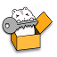

# key-box



## Project setup
```
npm install
```

## Compile and build
```
npm run release:<platform>
```

The concrete value of `<platform>` can be `win`, `mac` or `linux`.

## Run application
```
key-box/release/<app-release>/key-box
```
